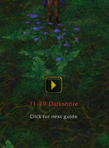
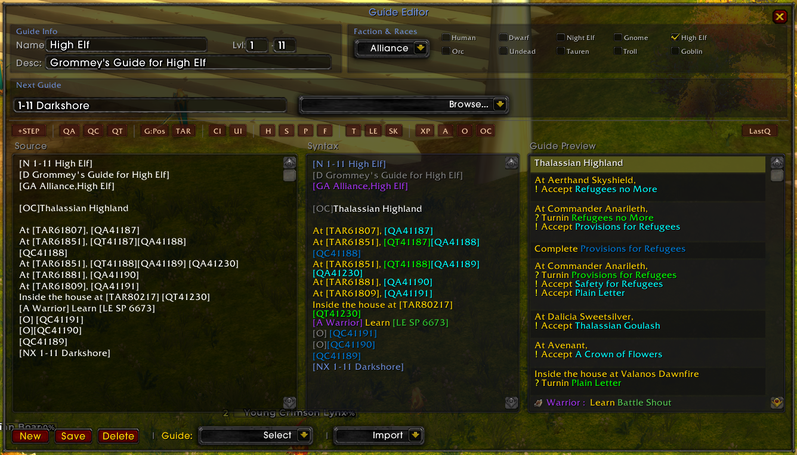

# Guidelime Vanilla BR

Pacote preparado por Kevinzinho.

# GuideLime Vanilla

## ⚠️ **$\color{rgb(255,0,0)}{\textsf{WORK IN PROGRESS}}$** ⚠️

A World of Warcraft Classic (1.12) addon providing an enhanced guide system with automatic quest tracking and autonomous navigation. Optimized for Turtle WoW with custom quest and NPC database support.

## Requirements

- **[Nampower](https://github.com/pepopo978/nampower)** - Required for spell learning detection and other advanced features

## Guide Packs

GuidelimeVanilla is a guide engine — guides are provided as separate addons:

| Guide Pack | Description |
|------------|-------------|
| **[GuidelimeVanilla_Sage](https://github.com/JeromeM/GuidelimeVanilla_Sage)** | Sage 1-60 Alliance leveling guides |

Install GuidelimeVanilla + a guide pack addon, then select your guide pack in **Settings > Guides**.

## Screenshots

#### Guide Full Screen :

#### Guide Window :
 

#### Arrow :
  

#### Guide Editor :

## Features

- **Built-in navigation arrow** with multi-waypoint sequences, minimap/world map dotted paths, and corpse navigation
- **Automatic quest tracking** — accept, complete, turnin, chain quests, objective progress
- **Item & skill tracking** — collection, equipment, profession progress bars
- **Talent suggestions** — level-up popup, talent frame highlighting, templates for all 9 classes
- **Smart automation** — auto-take flights, auto-skip impossible turnins, quest sync on guide load, optional pfQuest node hiding when a path is active
- **In-game guide editor** — three-panel layout, tag toolbar, metadata form, import from packs, account-wide storage
- **Clean UI** — minimap button, adjustable scaling, clickable URLs, dark theme

For the full feature list, see the **[Wiki - Features](https://github.com/JeromeM/GuidelimeVanilla/wiki/Features)**.

## Installation

1. Download and extract to `World of Warcraft/Interface/AddOns/`
2. Rename folder to `GuidelimeVanilla` (remove `-master` if needed)
3. Restart WoW or `/reload`

## Usage

1. Select a guide pack in **Settings > Guides** and click **Load**
2. Follow the steps — checkboxes update automatically as you play
3. The navigation arrow guides you to each objective

### Slash Commands

- `/glv show` / `/glv hide` — Toggle the guide window
- `/glv settings` — Open settings
- `/glv editor` — Open the in-game guide editor

## Documentation

Full documentation is available on the **[Wiki](https://github.com/JeromeM/GuidelimeVanilla/wiki)**:

- **[Features](https://github.com/JeromeM/GuidelimeVanilla/wiki/Features)** — Complete feature list
- **[Creating a Guide](https://github.com/JeromeM/GuidelimeVanilla/wiki/Creating-a-Guide)** — Tutorial for writing guide packs
- **[Tag Reference](https://github.com/JeromeM/GuidelimeVanilla/wiki/Tag-Reference)** — All guide tags with syntax and examples
- **[Creating a Talent Template](https://github.com/JeromeM/GuidelimeVanilla/wiki/Creating-a-Talent-Template)** — Talent suggestion system
- **[Guide Pack API](https://github.com/JeromeM/GuidelimeVanilla/wiki/Guide-Pack-API)** — Developer API reference

## Acknowledgments

- **Sage** — 1-60 Alliance leveling guides
- **Shagu** — Quest/NPC/Item databases (ShaguDB)
- **Astrolabe** — Coordinate management library
- **Original Guidelime** — Inspiration

## Support

Issues or feature requests? [Open a ticket on GitHub](https://github.com/JeromeM/GuidelimeVanilla/issues)
